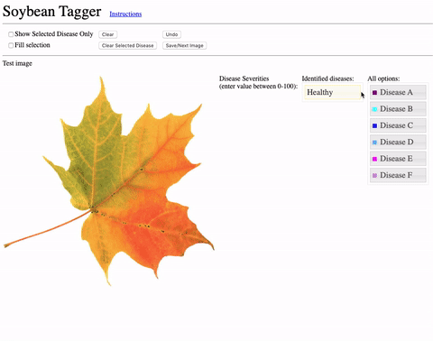

# Soybean Tagger

An web-based, mobile-friendly, image-segmentation application designed for use by the 
[Computational Physics and Mechanics Laboratory](https://www.me.iastate.edu/bglab/baskar-ganapathysubramanian/) at Iowa State 
University. This tool was specifically developed for marking diseased regions
on images of soybean leaves for the purpose of training a model to identify
diseased crops.

Check it out [here](https://jstimes.github.io/Soybean-Tagger) (it's in test mode, just enter any text to bypass login screen).

